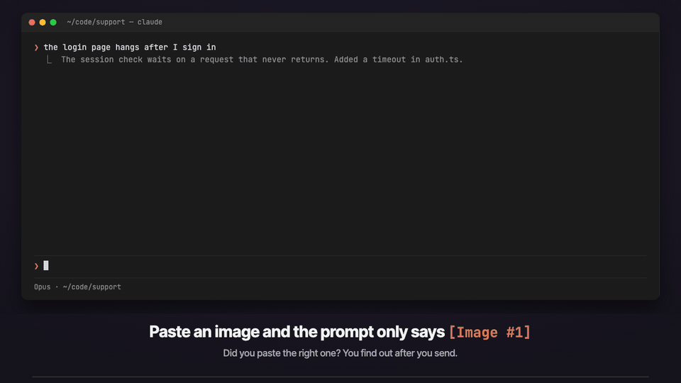

# Claude Image Preview

English | [繁體中文](#繁體中文)

**Paste a screenshot, see it before you send.**

A Claude Code mod that shows the images you paste: thumbnails above the prompt instead of bare `[Image #1]` tags, so you can check you pasted the right picture before you send. Click a thumbnail's `#N` label to enlarge it.



The demo is a recreated terminal, not a screen recording. Source: [demo/demo.html](demo/demo.html), recorded with [demo/record.py](demo/record.py) ([MP4](demo/demo.mp4)).

## Install

Inside Claude Code:

```
/plugin marketplace add f64991144/claude-image-preview
/plugin install image-preview@claude-image-preview
/reload-plugins
```

Paste an image into the prompt and its thumbnail appears above the input.

## Use

- **Check before sending.** Each pasted image shows as a tile labelled with its tag number. Wrong picture? Delete the `[Image #N]` tag with Backspace and paste again; the tile updates.
- **Enlarge.** Click the `#N` under a thumbnail and the picture opens large in a pane. Inside the pane, `o` opens the original in macOS Preview and `x` or Esc closes it.
  - Clicking needs the fullscreen layout: run `/tui fullscreen` (switch back with `/tui default`). In the default layout, press `ctrl+x tab` to focus the thumbnail row, then press the number.
  - If the terminal has no room for the pane, the picture opens in macOS Preview instead.
- **Clears on send.** Once the prompt is sent, or the tags are deleted, the row and the pane go away.

## Requirements

- Claude Code v2.1.287 or later (mods support)
- macOS or Linux (opening in Preview is macOS only)
- A terminal with the kitty graphics protocol, such as [Ghostty](https://ghostty.org), cmux or [kitty](https://sw.kovidgoyal.net/kitty/). Other terminals show `[Image #n]` text in each tile.

In a background session or agent view, Claude Code turns terminal images off. To turn them on, add this to the `env` block of `~/.claude/settings.json` and start a new session:

```json
"env": { "CLAUDE_CODE_FORCE_TERMINAL_IMAGES": "1" }
```

## Update

```
claude plugin update image-preview@claude-image-preview
```

## How it works

Claude Code saves each pasted image as `<tmp>/<project>/<session>/images/<n>.png`. Every 200 ms the mod reads the prompt box for `[Image #n]` tags, finds the cached PNGs, reads their size from the PNG header, and draws them above the prompt with Claude Code's `Image` element. Pasting an image raises no edit event, which is why it polls.

It makes no network requests and writes no files. It runs `id -u` once to find the default temp folder (when `CLAUDE_CODE_TMPDIR` is not set), and `open <file>` only when you ask for macOS Preview. Run `claude plugin validate .` on the repo to see every event it hooks and every call it makes.

## Troubleshooting

- **Nothing appears when I paste.** Run `/plugin` and check that `image-preview` is listed as an active mod; if not, run `/reload-plugins`.
- **The tile says "no preview".** The cached file wasn't found; Claude Code may have moved where it keeps pasted images. Please open an issue with your Claude Code version.
- **Clicking `#N` does nothing.** You are in the default layout, where the terminal does not pass clicks to Claude Code. Use `/tui fullscreen`, or `ctrl+x tab` then the number.

## Credits

Forked from [jarrodwatts/claude-image-view](https://github.com/jarrodwatts/claude-image-view) (MIT, Copyright (c) 2026 Jarrod Watts), which built the thumbnail row. This fork adds the enlarge pane and the Preview fallback, and is named `image-preview` so it does not clash with the upstream `image-view`. See [LICENSE](LICENSE) and [NOTICE](NOTICE).

## Development

```bash
git clone https://github.com/f64991144/claude-image-preview
cd claude-image-preview
claude --plugin-dir .        # load it for one session without installing
claude plugin validate .
claude plugin test .
```

---

## 繁體中文

讓你在 Claude Code 貼上的圖片看得到的 mod：輸入框上方顯示縮圖，取代只有 `[Image #1]` 的標籤，送出前就能確認貼對圖。點縮圖下方的 `#N` 可以放大。示範影片見上方（重建的終端機畫面，不是實機錄影）。

### 安裝

在 Claude Code 裡輸入：

```
/plugin marketplace add f64991144/claude-image-preview
/plugin install image-preview@claude-image-preview
/reload-plugins
```

### 使用

- **送出前確認**：每張貼上的圖都會出現一格縮圖，標著對應的編號。貼錯了就用 Backspace 刪掉 `[Image #N]` 再重貼，縮圖會跟著換。
- **放大**：點縮圖下方的 `#N`，會開一個面板顯示大圖。面板裡按 `o` 用 macOS「預覽程式」開原圖，按 `x` 或 Esc 關閉。
  - 用滑鼠點需要全螢幕模式：輸入 `/tui fullscreen`（改回來用 `/tui default`）。一般模式下，先按 `ctrl+x tab` 讓縮圖列取得焦點，再按數字。
  - 終端機太窄放不下面板時，改用「預覽程式」直接開圖。
- **送出後自動收起**：送出訊息或刪掉標籤後，縮圖和面板會消失。

### 需求

- Claude Code v2.1.287 以上
- macOS 或 Linux（用「預覽程式」開圖只限 macOS）
- 支援 kitty 圖形協定的終端機，例如 Ghostty、cmux、kitty。其他終端機的縮圖格只會顯示 `[Image #n]` 文字。

背景 session 或 agent view 預設不顯示圖片，要在 `~/.claude/settings.json` 的 `env` 加上 `"CLAUDE_CODE_FORCE_TERMINAL_IMAGES": "1"`，再開新的 session。

### 更新

```
claude plugin update image-preview@claude-image-preview
```

### 來源

改自 [jarrodwatts/claude-image-view](https://github.com/jarrodwatts/claude-image-view)（MIT 授權），縮圖列是原作的功能；放大面板與「預覽程式」備援是這個版本加的。
